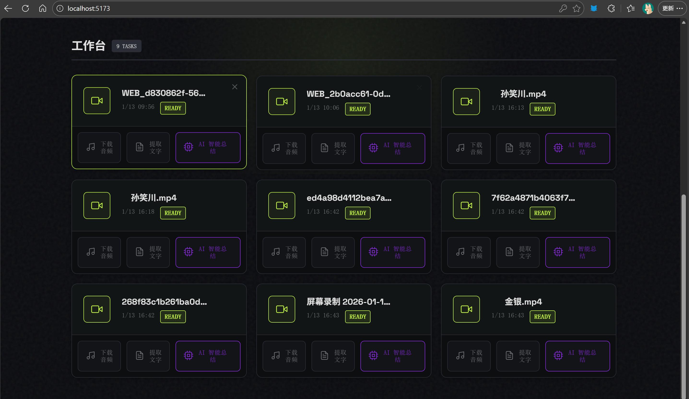
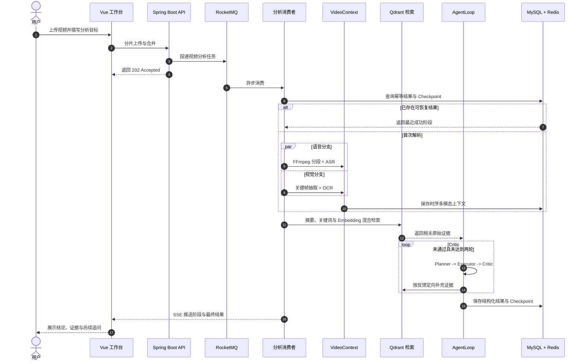

<div align="center">
  <h2>DoVideoAI</h2>
  
  <p>
    <a href="https://github.com/Xiaoc7r/DOVideo-AI/stargazers"></a>
    
    
    
    
    
    
    
    <a href="./LICENSE"></a>
  </p>
</div>

<div align="center">

面向长视频内容理解的 <strong>Video Agent</strong>。

致力于将长视频转化为可检索、可追溯、可继续追问的结构化知识。


</div>

## 项目预览

**登录与注册**


**视频工作台**



**Agent 目标输入**


**Agent 分析结果**


用户完成登录后，可以上传视频并在工作台管理解析任务；选择视频并输入分析目标后，可以手动选择分析模式，也可以交给 Agent 自动判断。工作台会展示结构化结论、时间戳证据、执行计划、阶段轨迹与质量评估，并支持基于同一视频继续追问。

## 核心功能

长视频处理天然是**长耗时、高资源消耗、外部调用成本敏感**的场景。DoVideoAI 的设计都围绕这一背景展开，可以概括为四层能力。

### 🎬 可靠的视频任务链路

> 把大文件上传与耗时的视频解析从请求主链路中剥离，提交即返回，不阻塞、不重复烧钱。

- **分片上传 + 断点续传** — 前端按 5 MB 分片，Redis 记录已完成分片，MinIO 保存合并后的视频，弱网中断后可从断点续传。
- **异步削峰** — RocketMQ 将视频解析移出请求线程，提交后立即返回任务 ID；Redisson 按「内容指纹 + 分析目标」加锁，拦截并发与重复消费。
- **成本护栏** — 用户级与全局令牌桶限制 AI 请求速率；ASR 与模型调用采用有限次数的指数退避重试，兜底第三方网络抖动。

### 🧩 时序多模态 VideoContext

> 把语音、画面文字与时间戳融合成一份可检索、可校验的统一上下文。

- **双分支抽取** — FFmpeg 将音频按 60 秒切片，同时通过场景变化检测抽取关键帧，并以 30 秒保底采样避免遗漏静态板书。
- **并行与容错** — ASR 与 OCR 使用独立有界线程池并行执行；相邻画面通过感知哈希去重，单路失败时仍保留另一条有效信息。
- **统一结构** — 语音区间、OCR 文本、关键帧与时间戳被合并为统一的 `VideoSegment`，后续检索与校验不再依赖底层模型格式。

```text
[02:00 - 03:00]
ASR      接下来讲解二叉树的前序遍历
OCR      前序遍历：根节点、左子树、右子树
Evidence frame_000125.jpg
```

### 🔁 有证据约束的 AgentLoop

> 每条结论都必须绑定可在原始视频中核验的时间戳证据，拒绝模型自由发挥。

- **角色分工** — Planner 将用户目标拆成可执行任务，Executor 生成固定结构的结论、证据与建议。
- **闭环校验** — Critic 检查目标覆盖、结构完整性与时间戳证据；不通过时依据缺失内容和时间范围定向重新检索。
- **自动模式路由** — 根据用户目标自动选择通用、学习、审查或创作模式；路由不可用时回退通用模式，不阻断分析任务。
- **四类结构化产物** — 通用模式生成结论与建议，学习模式生成大纲、自测题与易错点，审查模式定位逻辑漏洞与存疑结论，创作模式提取爆点、标题与口播脚本。
- **成本可控** — AgentLoop 最多执行两轮，既允许定向修正，也通过轮次上限约束延迟与 Token 成本。

### 🔍 长视频检索与断点恢复

> 面向数小时长视频的分段检索，以及分阶段可恢复的任务状态机。

- **混合检索** — 每 5 分钟生成片段摘要、关键词与 Embedding，通过关键词匹配与 Qdrant 语义召回选出 TopK 原始证据。
- **优雅降级** — Qdrant 或 Embedding 服务不可用时，退化到本地关键词与已有向量排序，不阻断主分析链路。
- **断点恢复** — Checkpoint 以 MySQL 为恢复真源、Redis 为热缓存，持久化 `VideoContext`、分块、计划、Critic 状态与最终结果。
- **状态可观测** — 前端通过 SSE 接收任务阶段；失败消息写入独立失败主题与失败任务表，可由管理接口重新投递。

## 系统流程



## 技术栈

| 层次 | 技术 | 用途 |
| :--- | :--- | :--- |
| Web | Vue 3、Vite、SSE、Marked | 上传、Agent 工作台、实时进度与安全 Markdown 展示 |
| API | Java 21、Spring Boot 3.5.9、Undertow、MyBatis-Plus | 鉴权、媒体管理、任务编排与 REST API |
| 异步与缓存 | RocketMQ 5.3.4、Redis 7.4、Redisson | 异步削峰、状态缓存、限流、锁与消费幂等 |
| 数据与存储 | MySQL 8、MinIO、Qdrant | 业务数据、视频对象、Checkpoint 与向量检索 |
| 视频与 AI | FFmpeg、Tesseract、LangChain4j、DeepSeek、TeleSpeechASR、BGE-M3 | 音视频处理、多模态解析、Agent 推理与 Embedding |
| 部署 | Docker Compose | 本地中间件编排 |

## 本地运行

### 环境要求

| 组件 | 要求 | 说明 |
| :--- | :--- | :--- |
| JDK | 21 | 后端运行环境 |
| Node.js | 22 | Vue 与 Vite 构建环境 |
| Docker | Compose v2 | 启动 MySQL、Redis、MinIO、Qdrant 与 RocketMQ |
| FFmpeg | 可在终端调用 | 音频切分与关键帧抽取 |
| Tesseract | 安装 `chi_sim` 与 `eng` | 中英文关键帧 OCR |
| yt-dlp | 可选 | 仅解析在线视频链接时需要 |

建议先确认命令均可用：

```bash
java -version
node --version
docker compose version
ffmpeg -version
tesseract --version
```

### 1. 准备配置

```bash
cp .env.example .env
```

编辑 `.env`，至少替换数据库、Redis、MinIO、Qdrant 的示例密码并设置 `SILICONFLOW_API_KEY`。全新数据库中 `DB_USERNAME` 与 `MYSQL_APP_USER` 应保持一致；`MYSQL_ROOT_PASSWORD` 仅供数据库初始化使用。密钥只保存在本地 `.env`，不要提交到仓库。

默认 LLM 为 `deepseek-ai/DeepSeek-V3.2`。历史示例模型 `deepseek-ai/DeepSeek-R1-Distill-Qwen-32B` 已被硅基流动禁用，会返回 `Model disabled`。`LLM_TIMEOUT_SECONDS` 默认是 `300`，用于避免长视频证据分析在模型响应尚未返回时过早超时；模型或超时配置变更后需要重启后端。

### 2. 启动中间件

```bash
./scripts/dev-up.sh
```

脚本会检查本机命令与版本、校验 Compose 配置，并等待 MySQL、Redis、MinIO、Qdrant 和 RocketMQ 启动。中间件与后端默认只监听 `127.0.0.1`，不会直接暴露到局域网；远程部署时再显式修改 `SERVER_ADDRESS` 并配置反向代理。

### 3. 启动后端

```bash
set -a
source .env
set +a

cd server
./mvnw spring-boot:run
```

后端默认地址为 `http://localhost:9090`，启动时会初始化项目所需数据表。另开终端确认服务可用：

```bash
curl http://localhost:9090/health
```

成功时返回 `{"code":0,"message":"success","data":"UP"}`。

### 4. 启动前端

```bash
set -a
source .env
set +a

cd client
npm ci
npm run dev
```

浏览器访问 `http://localhost:5173`。开发环境默认通过 Vite 代理访问后端；后端地址不同时修改 `VITE_DEV_PROXY_TARGET`，前后端分开部署时再设置 `VITE_API_BASE_URL`。

只查看前端 Agent 工作台时，可以打开 `http://localhost:5173/?demo`。Demo 模式使用内置示例数据，不依赖后端服务。

### 常见问题

| 现象 | 处理方式 |
| :--- | :--- |
| 后端无法连接 MySQL 或 Redis | 运行 `docker compose --env-file .env ps`，确认服务健康且 `.env` 密码一致 |
| 页面提示无法连接后端 | 先访问 `/health`；再检查 `VITE_DEV_PROXY_TARGET` 或 `VITE_API_BASE_URL` |
| 视频解析提示命令不存在 | 确认 `ffmpeg`、`tesseract` 可在终端执行，必要时配置 `FFMPEG_DIR`、`OCR_COMMAND` |
| AI 接口返回 401 或模型不可用 | 检查 `SILICONFLOW_API_KEY` 与模型名称，修改后重启后端 |
| Maven 提示 `maven-default-http-blocker` | 在 `server` 目录执行 `./mvnw -s .mvn/central-settings.xml spring-boot:run`，临时绕过失效的用户级镜像 |

停止本地中间件：

```bash
docker compose --env-file .env down
```

该命令不会删除 `mysql/data`、`redis/data`、`minio/data`、`qdrant/data` 或 RocketMQ 命名卷。需要完全重置时请先备份，再使用 `docker compose --env-file .env down --volumes` 并手动清理这些数据目录。

## 目录结构

```text
DoVideoAI
├── client/              # Vue 3 工作台
├── server/              # Spring Boot API 与 Video Agent
├── rocketmq/            # Broker 配置
├── docker-compose.yml   # 中间件编排
└── .env.example         # 本地配置模板
```

## License

本项目基于 [MIT License](LICENSE) 开源。
