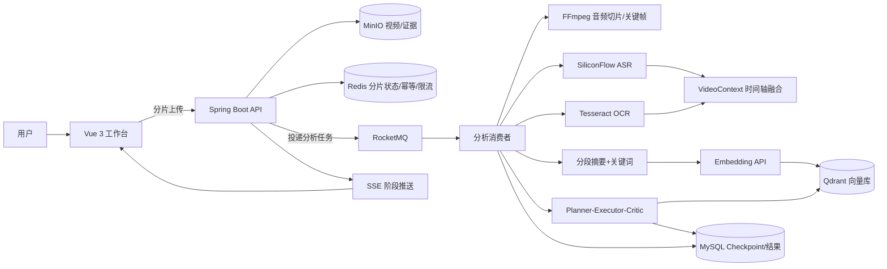

# VidMind 系统架构

VidMind 是一个面向长视频内容理解的 Video Agent 平台。核心思路是把“长耗时、高成本、容易失败”的视频分析从请求链路中拆出去，变成一条可观察、可恢复、可校验的异步流水线。

## 架构图

## 核心链路

1. 用户上传视频，前端按 5MB 分片上传，MinIO 保存分片，Redis 记录已完成分片。
2. 合并完成后，后端把分析任务投递到 RocketMQ，接口立刻返回任务 ID。
3. 消费者并行执行 ASR 和 OCR，按 60 秒时间轴融合成 VideoContext。
4. VideoContext 按 5 分钟粒度生成摘要、关键词和 Embedding，存入 Qdrant。
5. Agent 先检索相关证据，再按 Planner-Executor-Critic 循环生成并校验结论。
6. 每个阶段写入 MySQL Checkpoint，前端通过 SSE 实时看到进度。

## 设计要点

- MySQL 是事实源，Redis 是临时状态和提速层，MinIO 管大文件，Qdrant 管语义召回，RocketMQ 管异步解耦。
- 任务提交接口不等待分析完成，这是把长任务从 HTTP 同步链路中剥离的关键。
- ASR 负责“听”，OCR 负责“看”，VideoContext 负责把两者按时间轴对齐。
- Agent 不是连续调三次 LLM，而是 Planner 拆目标、Executor 生成带证据结论、Critic 校验并反馈，最多两轮。
